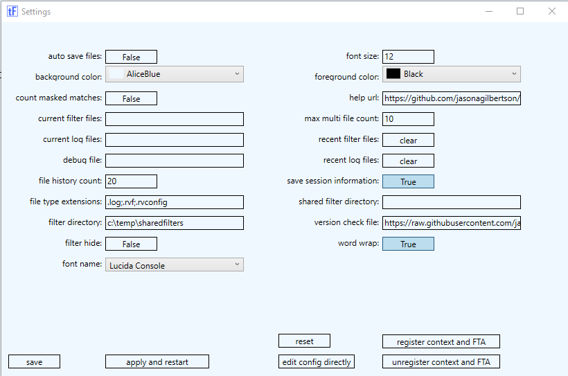

# TextFilter Configuration File

Below is the configuration file that controls some of the window behavior.
This information can be directly set from the gui. See Options -> Settings


If for some reason config file is lost, on next launch, a new config file will be generated.
If for some reason config file is corrupt, rename / delete config file and relaunch textFilter.

## Known issues: 
- If running multiple instances of textFilter, the first instance is the only one that will save information to the textFilter.exe.config file. This will be fixed in future version.

## Definitions:
- **AutoSaveFilters** - if enabled, will automatically save modified filters without prompting. If disabled and filter has been modified, a save prompt will be displayed on window close. 
- **BackgroundColor** - is the Background Color for the textFilter window. Refer to List of colors for names that can be used.
- **CountMaskedMatches** - if enabled, will count all matches regardless if match is 'masked' by a higher index. For example, if index 0 filter is excluding lines with 'fail', but index 1 would have matched that same line with its filter, that line would not be displayed, but would be counted in index 1 'count' field. Enabling this setting will decrease performance as all filters have to be checked.
- **CurrentFilterFiles** - List of filters that are currently being displayed in window. This value is automatically updated if 'SaveSessionInformation' is enabled. When starting textFilter, if this setting is populated, the filters will be opened automatically.
- **CurrentLogFiles** - List of log files that are currently being displayed in window. This value is automatically updated if 'SaveSessionInformation' is enabled. When starting textFilter, if this setting is populated, the log files will be opened automatically.
- **FileHistoryCount** - number of files to save in the config file for 'RecentFilterFiles' and 'RecentLogFiles'
- **FilterDirectory** - Default directory for creating and saving filter files. 
- **FilterHide** - if enabled, it will hide the top filter pane view in window.
- **FontName** - is the font name for text in window. 'Courier New' is default and is suitable for most scenarios as it is monospaced / fixed width. Any font that is loaded on machine however should work. For a list of default fonts for windows 8, see https://www.microsoft.com/typography/fonts/product.aspx?PID=164
- **FontSize** - is the size of text font in window.
- **ForegroundColor** - is the Foreground Color (text color) for the textFilter window. Refer to List of colors for names that can be used.
- **HelpUrl** - url to wiki help.
- **MaxMultiFileCount** - when using command line arguments and specifying wildcards, this value specifies the maximum number of files that will be opened on launch. See Running same command as above with 'MaxMultiFileCount' set to for additional information.
- **RecentFilterFiles** - history list of previous filter files. This setting is maintained automatically and limited by 'FileHistoryCount'. Currently this list is not viewable in gui. This will be viewable in gui in future version.
- **RecentLogFiles** - history list of previous log files. This setting is maintained automatically and limited by 'FileHistoryCount'. Currently this list is not viewable in gui. This will be viewable in gui in future version.
- **SaveSessionInformation** - if enabled, will update the settings in the config file at window close. This is useful if previous filter and log files should be reopened textFilter is restarted. 
- **SharedFilterDirectory** - if specified, is a unc path with directory structure forming the shared filters menu item list to be able to share filter files (.rvf).
- **VersionCheckFile** - if specified, is an xml file used to check exe version to display an update in title bar if newer version released.
- **WordWrap** - if enabled, lines will be wrapped to fit window.

## Example config file:
```
<?xml version="1.0" encoding="utf-8"?>
<configuration>
  <startup>
    <supportedRuntime version="v4.0" sku=".NETFramework,Version=v4.5" />
  </startup>
  <appSettings file="">
    <clear />
    <add key="AutoSave" value="True" />
    <add key="BackgroundColor" value="AliceBlue" />
    <add key="CountMaskedMatches" value="False" />
    <add key="CurrentFilterFiles" value="" />
    <add key="CurrentLogFiles" value="" />
    <add key="DebugFile" value="" />
    <add key="FileHistoryCount" value="20" />
    <add key="FilterDirectory" value="" />
    <add key="FilterHide" value="False" />
    <add key="FontName" value="Lucida Console" />
    <add key="FontSize" value="12" />
    <add key="ForegroundColor" value="Black" />
    <add key="HelpUrl" value="https://github.com/jasonagilbertson/TextFilter" />
    <add key="MaxMultiFileCount" value="10" />
    <add key="RecentFilterFiles" value="" />
    <add key="RecentLogFiles" value="" />
    <add key="SaveSessionInformation" value="False" />
    <add key="SharedFilterDirectory" value="" />
    <add key="VersionCheckFile" value="https://raw.githubusercontent.com/jasonagilbertson/TextFilter/master/TextFilter/version.xml" />
    <add key="WordWrap" value="True" />
  </appSettings>
</configuration>
```
