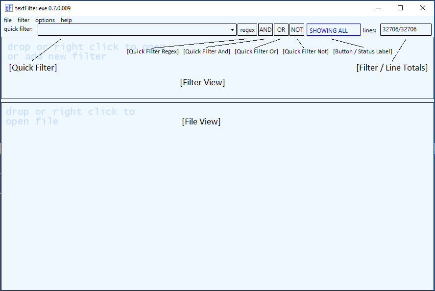

# Functions:
The functions that are currently available in textFilter can be accessed through either the Window Menu drop downs or from the two view context menus (right-click). Most functions also have an associated hot-key that is shown in the context menu as well. The window itself, Filter View and therefore File View are all resizable. 

**Window:**  
- Copy / Paste commands: copies selected text to clipboard. In File view, color, font, format, and size of selected text is copied both in txt and html format to clipboard. This allows pasting into notepad as well as OneNote without issue. In Filter view, only the selected text from the current cell is copied. At this time there is no way to copy entire row in Filter view.
  - Copy - Ctrl+C 
  - Paste - Ctrl+V 
  - Select All - Ctrl+A

**Opening filters and files:**  
There are multiple ways to open both filters and files for use in textFilter:
  - Using Command Line see Command line arguments for additional information
  - Dragging and dropping one or more files into Gui
    - **Note:** if textFilter was opened 'as Administrator / Run as Administrator' this functionality is automatically disabled by framework.
  - Opening one or more files from within Gui itself using the Open commands
  - By registering textFilter into the explorer file context menu using command line /registerfta from admin command prompt. See Command line arguments for additional information.
		

## Filter View:
---
### Context Menu:
	
- **Close Filter** - Ctrl+Alt+F4 - closes the currently active filter file. If configured in config and filter has changed, a save dialog prompt will be displayed.
- **Close All Filters** - closes all filter files.
- **Copy File Path** - will copy the file path of the currently active tab into clipboard.
- **Filter Notes** - views and stores filter notes for the filter file itself. Useful to store meta data about the filter file such as what filter applies to.  
	
- **Find Next** - F3 - moves cursor in file view to next occurrence of currently selected filter in the filter view.
- **New Filter** - Ctrl+Alt+N - opens new tab in filter view with a '-new x-' name. A file is not created until selecting to save or if configured in config file when closing application.
- **Open Containing Folder** - will open folder in explorer.exe where the file in the current tab is located.
- **Open Filter** - Ctrl+Alt+O - displays dialog prompt to open one or more existing filter files. Default extension for filters is currently .xml. For compatibility, Text Analysis Tool filter files .tat can also be opened and used.
- **Reload Filter** - will reload the file in the currently active tab.
- **Save Filter** - Ctrl+Alt+S - saves currently active filter file. If current file is 'new' the Save As dialog will be shown and tab will be renamed to new name when saved.
- **Save Filter As** - saves currently active filter file into new filter file. Default filter file extension is .xml. For compatibility, filter file can be saved as a .tat Text Analysis Tool filter file in the correct format. The 'Notes' field however will NOT be saved into .tat format.  
- **Shared Filters** - displays a folder / file treeview of .rvf filter files for path configured in options -> settings -> shared filter directory. This would typically be a network drive or UNC share.

## File View:
---
### Context Menu:

- **Close File** - Ctrl+F4 - closes currently active log file
- **Close All Files** - closes all log files. If a new view / tab was opened from an existing tab, utility will prompt to save view. Select 'Save Current View' from File View context menu to save the new view.
- **Copy File Path** - will copy the file path of the currently active tab into clipboard.
- **Export File** - displays the Export dialog where you can choose which fields to include in export to file or to clipboard. The separator can be modified as well as removing empty strings.  

- **Find Next** - F3 - moves cursor in file view to next occurrence of currently selected filter in the file view.
- **Goto Line** - Ctrl+G - navigates to specified line number in current file view. This will unfilter the current file view.  

- **Open Containing Folder** - will open folder in explorer.exe where the file in the current tab is located.
- **Open File** - Ctrl+O - displays Open File dialog box for one or more files to be opened.
- **Open View in new Tab** - Ctrl+N - opens currently filtered view in active tab into a new tab with a '-new x-' name. A file will NOT be created unless 'Save Current View' is selected. This is a known issue.
- **Reload File** - will reload the file in the currently active tab.  
- **Save Current View** - Ctrl+S - displays the Save As dialog box regardless if current tab is an existing file or if tab is a 'new' tab that has not been saved. Default location will be the location where file was opened. Default file name will be appended with '.filter'.
- **Show / Hide All Items (or click button)** - Ctrl+H - toggles between the filtered view and unfiltered view on current tab. If a 'Quick Filter' is specified, it toggles between 'Quick Filter' and unfiltered view.  

---
### File Edit Context:
- **add to existing filter** -

# Quick Filter:		
---
- **Quick Filter:** - used to filter file view without having to create a filter file. Quick Filter can be used in conjunction with a filter file using either string queries by default or regex. Quick filter string patterns can also contain 'AND' and / or 'OR' filter operators. The buttons below control how quick filter functions.
- **regex** - processes filter in 'quick filter' as a regex pattern instead of string.
- **AND** - displays any line in file view that matches both the quick filter AND one of the filters in the filter view if populated.
- **OR** - displays any line in file view that matches either the quick filter OR one of the filters in the filter view if populated.
- **NOT** - displays any line in file view that does NOT match filter pattern in quick filter.
- **Status / Button** - toggles between 'showing all' and 'filtered' views
- **Lines** - displays both the filtered line count and the total line count.  

# Reference:

		
